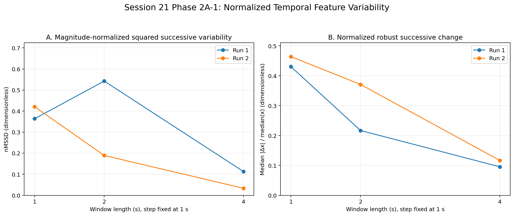

# EEG Feature Variability and Decision-Rule Sensitivity in an Offline EEG-to-Actuator Pipeline

This repository documents an independent research project examining the temporal
behavior of a window-level posterior-alpha spectral feature and how analysis and
decision-rule parameters affect downstream command states.

Public EEG recordings are used to build and evaluate the feature-to-command
pipeline, with selected EEG-derived command transitions replayed through a
Python–Arduino servo-gripper control path.

## Project at a Glance

**Current analysis scope**

- Dataset: public PhysioNet EEG Motor Movement/Imagery recordings accessed through MNE EEGBCI
- Current subject: Subject 1
- Recordings: baseline eyes-open and eyes-closed runs, analyzed separately
- Feature: `posterior_alpha_mean_psd`
- Temporal comparison: window length and step size
- Decision-rule comparison: threshold × causal smoothing × dwell
- Control validation: offline replay of selected EEG-derived command transitions

**Current research questions**

1. How do temporal-analysis parameters affect the variability of a window-level EEG-derived spectral feature?
2. How do threshold, smoothing, and dwell parameters affect command switching and short command episodes?
3. How do selected local feature events propagate through feature processing, threshold classification, and dwell confirmation?

The current results are methodological observations from two recordings of one
subject and are not treated as subject-generalizable findings.

## Analysis-to-Control Structure

```text
public EEG
→ 1–40 Hz filtering
→ posterior-channel selection
→ sliding windows
→ Welch PSD
→ posterior-alpha feature
→ optional causal smoothing
→ threshold classification
→ dwell confirmation
→ OPEN / CLOSE / STOP
→ selected offline replay
→ Python serial transmission
→ Arduino + servo gripper
````

The feature stream is also analyzed separately for temporal-parameter sensitivity
and variability. Decision-rule outputs are evaluated for switching, occupancy,
episodes, and event-level propagation.

## Selected Findings

**Temporal variability and local-event follow-up.**
Complementary variability measures captured different properties of the same
feature sequence. In the Run 1 feature stream extracted with 2 s windows and a
1 s step, two successive changes around a previously identified 24–26 s event
accounted for **81.84%** of recording-level centered successive-difference
variance.

**Decision-rule sensitivity.**
In the switch-sensitive threshold families under no smoothing, active
OPEN↔CLOSE switches decreased from **4 → 2 → 0** as dwell increased from
1 → 2 → 3 updates. The selected Run 1 event produced a command switch only
under the least restrictive dwell condition; longer dwell or causal median-3
smoothing suppressed that switch.

[Read the complete Session 21 analysis →](weekly-notes/session-21-260809.md)

### Representative Result



The two normalized successive-change measures capture different aspects of the
same feature stream. The Run 1 2 s condition motivated the subsequent local-event
follow-up documented in Session 21.

## Offline System Validation

Selected EEG-derived command transitions were replayed through a Python–Arduino
serial interface to a servo gripper after separate actuator and communication
validation. Source-linked replay records preserve the originating EEG-derived
command event and the corresponding serial response.

* [Milestone 05 — Offline EEG-Derived Replay-Control Integration](reports/milestone-05-session-17-to-20.md)
* [Stored-command replay video](media/session-19/videos/session19_integrated_stored-command_replay_v0.1.mp4)

## Selected Project Records

These records provide the main progression of the current project:

* [Milestone 04 — Window-Level EEG Feature-to-Command Pipeline](reports/milestone-04-session-13-to-16.md)
* [Milestone 05 — Offline EEG-Derived Replay-Control Integration](reports/milestone-05-session-17-to-20.md)
* [Session 21 — Decision-Rule Sensitivity and Temporal Feature Variability](weekly-notes/session-21-260809.md)

Detailed session-level records are available in [`weekly-notes/`](weekly-notes/).

## Current Direction

Current work is extending the analysis beyond the initial Subject 1 recordings
to examine which temporal-variability and decision-rule patterns remain
consistent across additional recordings and subjects.

Broader research interests include neural time-series dynamics, variability,
and methodological sensitivity in computational analysis of neural activity.

## Repository Structure

```text
src/          reusable EEG-feature, decision-rule, and serial modules
scripts/      session-level analysis and execution scripts
results/      numerical outputs, summaries, and metadata
figures/      analysis and diagnostic figures
reports/      milestone-level research summaries
weekly-notes/ session-level research records
firmware/     Arduino firmware
media/        actuator validation and replay evidence
docs/         project-level documentation and setup records
```

## Reproducibility

The project uses Python 3.11 and records its environment and package structure in:

* [`environment.yml`](environment.yml)
* [`requirements.txt`](requirements.txt)
* [`pyproject.toml`](pyproject.toml)

Analysis scripts, numerical outputs, metadata, and research records are retained
within the repository to preserve links between implementation, results, and
interpretation.
