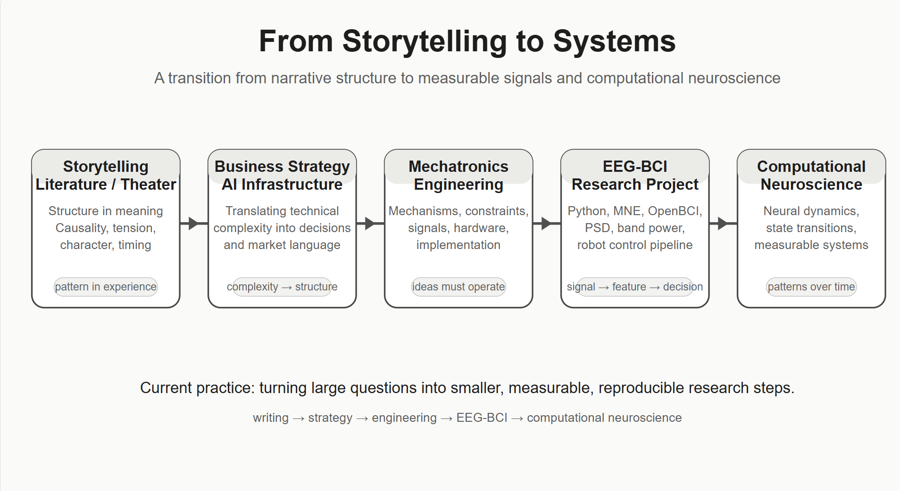

# 이야기에서 시스템으로 이동한 이유

*문학, 비즈니스 전략, 공학을 거쳐 computational neuroscience로 향하게 된 과정.*

나는 neuroscience에서 출발하지 않았다.

오랫동안 내 질문은 오히려 문학, 연극, 철학, 사회적 사유에 더 가까웠다.

사람들은 왜 서로를 오해하는지, 같은 상황에서도 왜 완전히 다르게 반응하는지, 언어는 어떤 순간에는 사람을 연결하면서도 어떤 순간에는 완전히 실패하는지, 그리고 세계는 왜 반복성과 차이를 동시에 가지고 있는지 궁금했다.

처음에는 글쓰기가 그런 질문을 다루기에 적절한 도구처럼 느껴졌다.

소설은 단순히 문장의 나열이 아니다. 희곡도 단순한 대사의 모음이 아니다. 둘 다 하나의 세계를 필요로 한다. 그 세계 안에는 내부 규칙, 긴장, 인과, 타이밍, 그리고 각자의 history와 condition에 따라 다르게 반응하는 인물들이 필요하다.

그런 의미에서 storytelling은 나에게 pattern을 보는 법을 가르쳐주었다.

하지만 어느 순간부터 해석만으로는 충분하지 않다고 느끼기 시작했다.

나는 어떤 것이 무엇을 의미하는지만 알고 싶었던 것이 아니다. 그것이 어떻게 작동하는지 알고 싶었다.

## 의미에서 메커니즘으로

인문학과 예술은 의미를 생각하는 강력한 도구를 제공해주었다.

그것들은 모호함, 갈등, 정체성, 욕망, 해석을 이해하는 언어를 주었다. 인간 경험을 설명하는 풍부한 틀을 제공했다.

하지만 많은 설명이 너무 일찍 멈춘다는 느낌을 받기 시작했다.

인간의 차이를 설명할 수는 있었지만, 그 차이가 어떤 mechanism에서 발생하는지는 충분히 보여주지 못했다. 갈등을 묘사할 수는 있었지만, 서로 다른 internal state, history, environment, interaction이 어떻게 서로 다른 outcome을 만들어내는지는 항상 설명하지 못했다.

나는 해석의 아래에 있는 무언가를 찾고 있다는 느낌을 받았다.

하나의 정답을 찾는 것은 아니었다.

단순한 공식도 아니었다.

다만 이런 방식으로 질문하고 싶었다.

> 어떤 종류의 system이 이런 종류의 pattern을 만들어내는가?

이 질문은 점차 나를 공학 쪽으로 이동시켰다.

## 공학이 바꾼 것

공학과의 첫 진지한 접촉은 대학 연구실에서 시작된 것이 아니었다.

그것은 일하면서 시작되었다.

나는 business와 strategy role로 AI infrastructure와 high-performance computing의 세계에 들어갔다. 내가 GPU server를 직접 설계한 것은 아니지만, abstract computation이 물리적 시스템이 되는 환경 안에 있었다. Hardware architecture, liquid cooling, monitoring, serial communication, data center infrastructure, large-scale operational constraint 같은 것들을 가까이서 보았다.

그 환경은 내가 생각하는 방식을 바꾸었다.

그전까지 나는 meaning, narrative, structure의 언어로 생각하는 데 익숙했다.

공학은 나에게 operation의 언어로 생각하게 했다.

System은 작동하거나 작동하지 않는다.  
Signal은 측정되거나 측정되지 않는다.  
Device는 반응하거나 반응하지 않는다.  
Design은 constraint를 통과하거나 실패한다.

이것은 신선했다.

아이디어는 구현을 통과해야만 현실이 된다는 것을 보여주었기 때문이다.

동시에 공학은 나에게 그것만의 한계도 보여주었다. 공학은 작동하는 것을 만든다는 점에서 강력하다. 하지만 내가 가장 깊이 궁금했던 것은 단지 시스템을 어떻게 만들 것인가가 아니었다. 서로 다른 system이 왜 서로 다른 pattern을 만들어내는지, 작은 변화가 어떻게 전파되는지, 안정적인 structure가 interaction에서 어떻게 emergent하게 나타나는지가 더 궁금했다.

그래서 나는 의미를 버리고 싶었던 것이 아니다.

의미를 mechanism과 연결하고 싶었다.



## 왜 computational neuroscience인가

그래서 computational neuroscience가 중요해졌다.

Neuroscience가 모든 질문의 최종 답이라고 생각하기 때문은 아니다.

또 인간의 삶을 brain activity로 환원하고 싶기 때문도 아니다.

오히려 brain은 physical signal, biological structure, information processing, behavior, experience가 만나는 매우 흥미로운 system 중 하나다.

Brain은 측정 가능한 system이다.

동시에 시간에 따라 변하는 system이다.

그 안에는 noise, variability, feedback, adaptation, state transition이 있다. Brain은 static object가 아니다. Brain은 dynamical system이다.

내가 관심을 갖는 지점은 여기에 있다.

나는 neuroscience를 단순히 brain을 연구하는 분야로만 보는 것이 아니라, interacting components에서 complex pattern이 어떻게 emergent하게 나타나는지 공부할 수 있는 training ground로 보고 있다.

이 framing은 내가 던지는 질문의 형태를 바꾼다.

얕은 형태의 질문은 다음과 같을 수 있다.

> EEG로 focus를 감지할 수 있는가?

더 유용한 질문은 다음과 같다.

> 정의된 experimental condition 아래에서, 측정 가능한 EEG feature가 reliable하게 변하는가?

더 깊은 future question은 다음과 같을 수 있다.

> System이 state 사이를 이동할 때 neural feature는 시간에 따라 어떻게 evolve하는가?

지금 단계에서 나는 마지막 질문에 답할 준비가 되어 있지 않다.

하지만 더 작은 질문에서 시작할 수는 있다.

## 왜 EEG와 BCI에서 시작하는가

현재 내가 진행 중인 프로젝트는 EEG-based BCI robot control study다.

겉으로 보면 이것은 mind로 machine을 제어하는 프로젝트처럼 들릴 수 있다.

하지만 나는 그렇게 framing하지 않는다.

나에게 이 프로젝트는 abstract question을 measurable system으로 낮추는 방법을 배우는 과정이다.

Pipeline은 다음과 같다.

```text
brain state change
→ EEG acquisition
→ preprocessing
→ feature extraction
→ decision rule
→ robot command
```

이 pipeline의 각 화살표는 하나의 문제다.

Brain state는 직접 보이지 않는다.  
EEG는 noisy하고 indirect하다.  
Raw signal은 곧바로 해석 가능하지 않다.  
Feature는 조심스럽게 정의되어야 한다.  
Threshold는 theory만 보고 정하면 안 된다.  
Robot은 내가 signal의 의미를 추측했다는 이유로 움직이면 안 된다.

그래서 나는 이 프로젝트를 단계별로 기록하고 있다.

먼저 화려한 demo를 만들고 싶은 것이 아니다.

Signal에서 feature로, feature에서 decision으로 이어지는 조심스러운 경로를 만들고 싶다.

## Raw signal에서 measurable feature로

프로젝트의 첫 단계에서는 EEG가 실제로 무엇을 측정하는지, 그리고 왜 EEG를 mind reading처럼 해석하면 안 되는지를 공부했다.

그다음 signal analysis로 넘어갔다.

Python environment를 구축하고, synthetic signal을 생성하고, basic PSD pipeline을 테스트하고, public EEG dataset을 불러오고, raw EEG structure를 확인하고, eyes-open / eyes-closed condition을 alpha power로 비교했다.

이것은 작은 기술적 단계처럼 보일 수 있다.

하지만 나에게는 중요했다.

EEG가 concept에서 data로 바뀌었기 때문이다.

나는 EEG를 더 이상 신비로운 waveform으로만 보지 않고, structured numerical time-series data로 보기 시작했다.

```text
channels × samples
```

그다음 signal을 frequency domain으로 변환하고, band power를 계산하고, defined condition을 비교할 수 있었다.

공개 EEG dataset에서는 eyes-closed baseline condition과 eyes-open baseline condition 사이에서 posterior alpha power 차이를 관찰했다.

조심스러운 해석은 다음이 아니다.

```text
eyes closed = relaxation
eyes open = focus
```

조심스러운 해석은 다음과 같다.

> 두 개의 정의된 experimental condition 사이에서 측정 가능한 spectral feature가 달라졌다.

덜 극적으로 들릴 수 있다.

하지만 나는 바로 이런 문장을 할 수 있게 되고 싶다.

## 왜 기록이 중요한가

나는 research가 결과를 내는 것만으로 이루어지지 않는다는 것도 배우고 있다.

Research는 나중에 검토할 수 있는 trail을 남기는 일이다.

그래서 나는 weekly notes, milestone reports, scripts, figures, blog posts를 public GitHub repository에 기록하고 있다.

형식은 의도적으로 구조화했다.

```text
objectives
what I studied
key takeaways
my understanding
questions / unclear points
next actions
outputs
references
```

이 형식은 프로젝트가 일기로 흐르지 않도록 도와준다.

동시에 프로젝트가 performance처럼 보이지 않도록 도와준다.

나는 기록이 내가 무엇을 이해했고, 무엇을 이해하지 못했고, 무엇을 테스트했고, 무엇을 만들었고, 다음에 무엇을 해야 하는지를 보여주기를 원한다.

이 습관은 내 background가 linear하지 않기 때문에 더 중요하다.

나는 undergraduate neuroscience degree에서 neuroscience lab으로 곧장 이동한 사람이 아니다.

Writing과 theater에서 business strategy로, business strategy에서 engineering으로, engineering에서 computational neuroscience로 이동하고 있다.

그렇기 때문에 documentation은 단순한 습관이 아니다.

나에게는 credibility를 쌓는 방식의 일부다.

## 큰 질문을 작게 유지하기

이 경로 뒤에는 훨씬 더 큰 질문이 있다.

나는 interaction에서 stable pattern이 어떻게 emergent하게 나타나는지에 관심이 있다.

State, history, condition의 작은 차이가 어떻게 다른 trajectory를 만들어내는지에 관심이 있다.

세계가 왜 common structure와 radical difference를 동시에 가지는지에 관심이 있다.

하지만 이런 질문은 너무 커서 직접 다룰 수 없다.

그래서 작게 유지해야 한다.

지금의 질문은 다음이 아니다.

> 현실의 fundamental structure는 무엇인가?

현재 질문은 다음이다.

> 정의된 condition 아래에서 simple EEG feature를 reliable하게 측정할 수 있는가?

더 작은 질문이다.

하지만 실제 질문이다.

그리고 작은 질문을 조심스럽게 다룰 수 없다면, 큰 질문에 대해 주장할 자격도 없다.

## 내가 되려고 하는 것

나는 이 전환을 이전 background를 버리는 일로 생각하지 않는다.

Writing은 experience 안에서 structure를 보는 법을 가르쳐주었다.

Business strategy는 complexity를 decision으로 번역하는 법을 가르쳐주었다.

Engineering은 mechanism과 constraint를 존중하는 법을 가르쳐주었다.

Computational neuroscience는 이 습관들을 더 rigorous한 research practice로 가져가려는 장소다.

내 목표는 technical language를 사용해서 vague idea를 과학적으로 보이게 만드는 사람이 되는 것이 아니다.

오히려 반대다.

크고 직관적인 질문을 더 작고, testable하고, measurable한 형태로 낮추고 싶다.

그것이 내가 만들고 싶은 discipline이다.

## Closing

나는 여전히 story에 관심이 있다.

하지만 storytelling에서 멈추고 싶지는 않다.

나는 여전히 meaning에 관심이 있다.

하지만 meaning을 가능하게 하는 system을 이해하고 싶다.

나는 여전히 human difference에 관심이 있다.

하지만 점점 더 system 전반에서 difference, stability, transition, pattern을 만들어내는 dynamics에 관심이 있다.

그것이 내가 storytelling에서 systems로 이동한 이유다.

그리고 그것이 지금 내가 EEG에서 시작하는 이유다.

EEG가 모든 것을 답해줄 수 있어서가 아니다.

EEG는 시작할 수 있는 장소를 제공하기 때문이다.

```text
a signal
a system
a measurable feature
a condition change
a next question
```

지금 단계에서는 그것으로 충분하다.

---

## Note

This post is a personal reflection on my transition from writing, business strategy, and engineering toward computational neuroscience.

My current project is an EEG-BCI robot control study documented through GitHub, milestone reports, and technical blog posts. At this stage, the goal is not to make strong claims about cognition or consciousness, but to build a careful research practice around measurable signals, defined conditions, and reproducible analysis.

## Project Repository

The project notes and session logs are archived on GitHub:

[EEG-BCI Robot Control Project](GITHUB_REPOSITORY_LINK)
