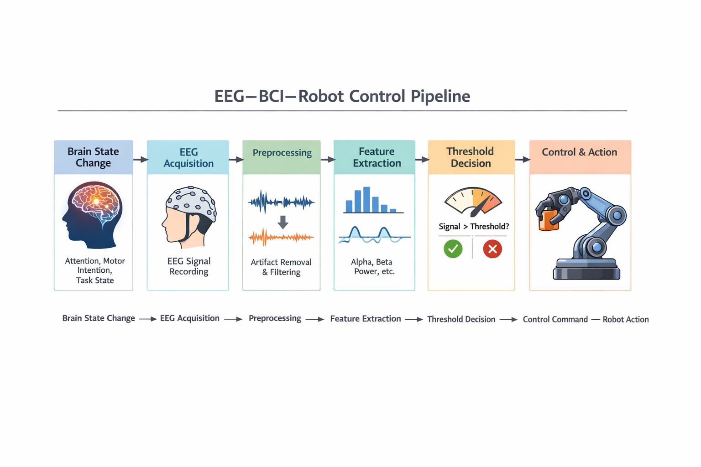

# Session 01

## 1. Objectives
- 프로젝트 전체 목표, 최종 결과물, 연간 흐름 정리
- EEG, BCI, 로봇 제어 간 연결 구조 개요 파악
- 뇌의 기본 구조 및 인지 구조 학습 (01)

## 2. What I studied
- 운동 및 감각 관련 뇌 구조
- 자발적 운동과 감각-운동 위계
- 신경세포의 전기적/화학적 전달 개요
- 주의력과 고위 인지 기능의 기본 개념

## 3. Key takeaways
### 1. EEG–BCI–로봇 제어의 기본 연결 구조
본 프로젝트의 최소 구조는 다음과 같이 정리할 수 있다.

brain state change  
→ EEG acquisition  
→ preprocessing / noise reduction  
→ feature extraction  
→ threshold-based decision  
→ control command generation  
→ robot actuation

This pipeline can be interpreted step by step as follows:
- Brain state change: attention, voluntary motor intention, or task engagement changes neural activity.
- EEG acquisition: these changes are indirectly measured from the scalp.
- Preprocessing: artifacts and noise must be reduced before analysis.
- Feature extraction: raw signals are converted into interpretable features such as alpha/beta power.
- Threshold-based decision: simple decision rules are applied to extracted features.
- Command generation and actuation: interpreted states are converted into robot control commands.

즉, 뇌 상태 변화가 바로 로봇 동작으로 이어지는 것이 아니라,  
EEG 신호를 수집한 뒤 전처리 및 feature 추출을 거쳐 제어 가능한 형태로 바꾸는 과정이 필요하다.

### 2. threshold 기반 제어의 의미
현재 구상 중인 threshold 기반 로봇 실험 제어는 의지가 개입하는 자발적 운동, 주의력, 과제 수행 상태와 같은 기능을 중심으로 설계될 가능성이 높다.
따라서 초기 단계에서는 해석 가능성이 높은 feature를 정하고, threshold를 이용해 제어 신호를 발생시키는 방식이 적절하다.

### 3. 뇌 구조와 기능은 단순 분절보다 연결성이 중요하다
뇌 기능은 특정 영역에 단순히 고정된 것이 아니라 여러 구조의 상호작용을 통해 나타난다. 따라서 EEG 기반 제어에서는 노이즈 제거뿐 아니라, 기능 간 연관성을 어떻게 해석하고 실험 설계에 반영할지도 중요한 과제가 된다.

## 4. My understanding
### 1. 운동 및 감각 관련 구조
- 전두엽 일부는 운동 영역과 관련되며, 자발적 운동 계획 및 실행에 관여한다.
- 중심고랑 주변에는 신체 부위에 대응하는 몸 순서 지도가 존재한다.
- 두정엽에는 몸감각 피질과 감각 연합 영역이 위치한다.
- 후두엽은 시각, 측두엽은 청각과 밀접하게 연결된다.
- 감각 정보는 단순 입력으로 끝나지 않고, 운동 계획 및 실행과 연계된다.

### 2. 운동 계획과 실행의 위계
- 감각 피질 및 연합 영역은 외부 및 신체 상태 정보를 제공한다.
- PPC(후두성 피질)는 목표 지향적 운동에 필요한 공간 정보를 통합하는 상위 단계로 이해할 수 있다.
- 전운동영역(PMA)은 운동 프로그램과 계획에 관여한다.
- 일차운동피질(M1)은 계획된 움직임을 실제 신체 운동으로 실행하는 단계와 연결된다.

현재 프로젝트 관점에서는 이러한 위계가 중요하다.  
즉, 단순히 “움직인다”가 아니라 감각–통합–계획–실행의 흐름 속에서 자발적 운동이 발생한다는 점을 이해해야 한다.

### 3. 언어 및 고위 인지 기능
이 부분은 직접적인 로봇 제어보다는, 뇌 기능이 단일 부위가 아니라 경로와 연결망 수준에서 작동한다는 점을 이해하는 데 의미가 있다.

- 좌뇌는 언어 의미와 문법 처리 중심적, 우뇌는 말소리의 음향적 특성 및 운율 처리와 관련된다.
- 언어 처리 모델은 청각 입력 → 청각 피질 → 의미 이해 → 말 산출 → 운동 중추라는 흐름으로 정리할 수 있다.

### 4. 신경세포와 신경전달
- 뇌는 매우 많은 신경세포로 구성되어 있다.
- 신경세포는 전기적 신호를 만들고, 시냅스에서 화학적 신호로 바꾸어 다음 세포로 전달한다.
- 신경전달물질은 도파민, 세로토닌, 노르에피네프린, 아세틸콜린 등 매우 다양하다.

이 점은 EEG가 결국 신경세포 집단의 전기적 활동 변화와 연결된다는 점에서 중요하다.

### 5. 주의력과 고위 인지 기능
- 주의력은 제한된 정신적 자원을 특정 정보처리 과제에 투입하는 능력이다.
- 각성, 정향, 선택적 주의, 지속적 주의 등 여러 단계로 이해할 수 있다.
- 전두-선조체 신경망, 외측 전전두 피질, 대상피질, 소뇌 등 다양한 구조가 관여한다.

현재 프로젝트에서 가장 중요한 부분 중 하나는 바로 이 주의력 관련 구조다.  
집중 상태 기반 threshold 제어를 설계하려면, 주의가 단일 부위가 아니라 여러 영역의 상호작용이라는 점을 염두에 둘 필요가 있다.

## 5. Questions / Unclear points
- 자발적 운동 의도와 주의 집중 상태 중, 초기 BCI 제어 feature로 어느 쪽이 더 안정적인가?
- beta power 같은 단일 feature가 실제 제어 신호로 충분히 작동할 수 있는가?
- 뇌 기능 간 상호연결성을 EEG 수준에서 어느 정도까지 해석할 수 있는가?
- threshold 기반 제어를 넘어갈 경우, 어떤 feature 조합 또는 수학적 모델이 적절할까?

## 6. Next actions
- 뇌의 기본 구조 및 인지 구조 학습 이어가기
- 집중 상태와 관련된 EEG 개념 정리
- alpha / beta / theta 대역의 의미 비교
- 집중 상태를 반영할 수 있는 feature 후보를 추리기
- 향후 실험 조건(rest, focus 등)의 초안 아이디어를 잡기

## 7. Outputs
- EEG–BCI–robot control conceptual pipeline draft
- Session 01 study note
- 뇌 구조 및 기능 요약 정리
- Figure: 
- docs: [session-01-core-brain-function-structure](../docs/outputs/session-01-core-brain-function-structure.md)
