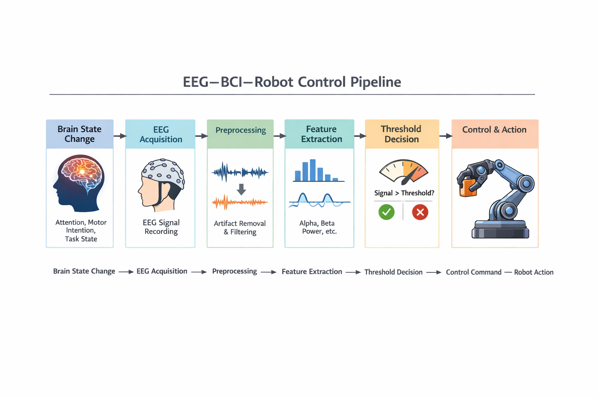

# Session 01

## 1. Objectives

* 프로젝트 전체 목표, 최종 결과물, 연간 흐름 정리
* EEG, BCI, 로봇 제어 간 연결 구조 개요 파악
* 뇌의 기본 구조 및 인지 구조 학습 (01)

## 2. What I studied

* EEG–BCI–robot control conceptual pipeline
* 운동 및 감각 관련 뇌 구조
* 자발적 운동과 감각-운동 위계
* 신경세포의 전기적 / 화학적 전달 개요
* 주의력과 고위 인지 기능의 기본 개념

## 3. Key takeaways

### 1. EEG–BCI–robot control requires a staged signal-processing pipeline

본 프로젝트의 최소 구조는 다음과 같이 정리할 수 있다.

```text
brain state / task state change
→ EEG acquisition
→ preprocessing / noise reduction
→ feature extraction
→ threshold-based decision
→ control command generation
→ robot actuation
```

즉, 뇌 상태 변화가 바로 로봇 동작으로 이어지는 것이 아니다.

EEG 신호를 수집한 뒤, 전처리와 feature extraction을 거쳐 제어 가능한 형태로 바꾸는 과정이 필요하다.

### 2. Threshold-based control is a simple initial control structure

Threshold 기반 제어는 초기 BCI-robot control 실험에서 사용할 수 있는 단순한 decision rule이다.

이 방식에서는 먼저 측정 가능한 EEG feature 후보를 정하고, 해당 feature가 기준값을 넘는지 여부에 따라 제어 명령을 발생시킨다.

현재 단계에서는 feature를 확정하기보다, 향후 실험에서 비교할 수 있는 feature 후보와 decision rule의 형태를 정리하는 것이 우선이다.

### 3. Brain functions should be understood as connected processes, not isolated modules

뇌 기능은 단일 영역 하나로 설명하기보다, 과제 조건과 여러 기능의 연결로 이해하는 것이 적절하다.

EEG 기반 제어에서도 “어느 뇌 영역이 켜졌는가”보다, 어떤 과제 상태가 어떤 EEG feature 후보와 연결될 수 있는지를 먼저 정리해야 한다.

## 4. My understanding

### 1. 운동 및 감각 관련 구조

* 전두엽 일부는 운동 영역과 관련되며, 자발적 운동 계획 및 실행에 관여한다.
* 중심고랑 주변에는 신체 부위에 대응하는 몸 순서 지도가 존재한다.
* 두정엽에는 몸감각 피질과 감각 연합 영역이 위치한다.
* 후두엽은 시각, 측두엽은 청각 처리와 관련된다.
* 감각 정보는 단순 입력으로 끝나지 않고, 운동 계획 및 실행과 연결된다.

현재 프로젝트 관점에서는 감각 입력과 운동 출력이 분리된 과정이 아니라 연결된 처리 흐름이라는 점이 중요하다.

### 2. 운동 계획과 실행의 위계

운동은 단순히 “움직인다”는 결과만으로 이해하기보다, 감각 정보와 목표가 운동 계획 및 실행으로 이어지는 과정으로 이해할 수 있다.

초기 이해는 다음과 같다.

```text
sensory / body state information
→ posterior parietal cortex(PPC; 뒤쪽 두정피질)
→ premotor area(PMA)
→ primary motor cortex(M1)
→ motor execution
```

* 감각 피질 및 연합 영역은 외부 및 신체 상태 정보를 제공한다.
* PPC는 목표 지향적 운동에 필요한 공간 정보와 감각 정보를 통합하는 상위 단계로 이해할 수 있다.
* 전운동영역(PMA)은 운동 프로그램과 계획에 관여한다.
* 일차운동피질(M1)은 계획된 움직임의 실행 단계와 연결된다.

이 위계는 향후 자발적 운동 의도나 과제 수행 상태를 BCI feature 후보로 볼 수 있는지 판단할 때 필요한 배경 개념이다.

### 3. 언어 및 고위 인지 기능

언어 기능은 직접적인 로봇 제어보다는, 뇌 기능이 단일 부위가 아니라 경로와 연결망 수준에서 작동한다는 점을 이해하는 데 의미가 있다.

언어 처리는 대략 다음 흐름으로 이해할 수 있다.

```text
auditory input
→ auditory cortex
→ language comprehension
→ speech planning
→ motor output
```

이 구조는 고위 인지 기능도 입력, 통합, 계획, 출력이 연결된 과정으로 나타난다는 점을 보여준다.

### 4. 신경세포와 신경전달

* 신경세포는 전기적 신호를 만들고, 시냅스에서 화학적 신호로 바꾸어 다음 세포로 전달한다.
* 신경전달물질에는 도파민, 세로토닌, 노르에피네프린, 아세틸콜린 등이 있다.
* EEG는 개별 신경세포 하나의 활동이 아니라, 신경세포 집단의 전기적 활동 변화와 관련된다.

이 점은 EEG signal을 뇌 상태의 직접적인 “읽기”가 아니라, 집단적 전기 활동의 간접 측정으로 이해해야 한다는 점에서 중요하다.

### 5. 주의력과 고위 인지 기능

* 주의력은 제한된 정신적 자원을 특정 정보처리 과제에 배분하는 능력으로 이해할 수 있다.
* 각성, 정향, 선택적 주의, 지속적 주의 등 여러 하위 과정으로 나눌 수 있다.
* 전두-선조체 신경망, 외측 전전두 피질, 대상피질, 소뇌 등 다양한 구조가 관련된다.

현재 프로젝트에서는 주의력 관련 상태가 초기 EEG feature 후보 중 하나가 될 수 있다.

집중 상태 기반 threshold control을 검토하려면, 주의가 단일 부위의 활동이 아니라 여러 영역의 상호작용이라는 점을 고려해야 한다.

## 5. Questions / unclear points

* 자발적 운동 의도와 주의 집중 상태 중, 초기 BCI 제어 feature로 어느 쪽이 더 안정적인가?
* Beta power 같은 단일 feature가 실제 제어 신호로 충분히 작동할 수 있는가?
* 뇌 기능 간 상호연결성을 EEG 수준에서 어느 정도까지 해석할 수 있는가?
* Threshold 기반 제어를 넘어갈 경우, 어떤 feature 조합 또는 수학적 모델이 적절할까?

## 6. Next actions

* 뇌의 기본 구조 및 인지 구조 학습 이어가기
* 집중 상태와 관련된 EEG 개념 정리
* Alpha / beta / theta 대역의 의미 비교
* 집중 상태를 반영할 수 있는 feature 후보 정리
* 향후 실험 조건(rest, focus 등)의 초안 아이디어 정리

## 7. Outputs
- EEG–BCI–robot control conceptual pipeline draft
- Session 01 study note
- 뇌 구조 및 기능 요약 정리
- docs: [session-01-core-brain-function-structure](../docs/weekly-notes-outputs/session-01-core-brain-function-structure.md)
- Figure: 

This pipeline can be interpreted step by step as follows:
- Brain state change: attention, voluntary motor intention, or task engagement changes neural activity.
- EEG acquisition: these changes are indirectly measured from the scalp.
- Preprocessing: artifacts and noise must be reduced before analysis.
- Feature extraction: raw signals are converted into interpretable features such as alpha/beta power.
- Threshold-based decision: simple decision rules are applied to extracted features.
- Command generation and actuation: interpreted states are converted into robot control commands.

## 8. References
- 정천기 외, 『사람 뇌의 구조와 기능』, 범문에듀케이션, 2015.
